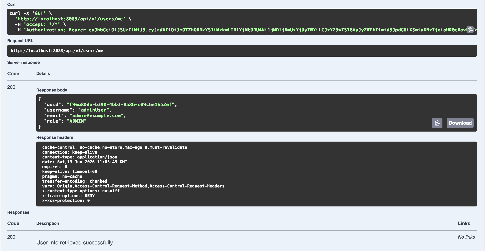
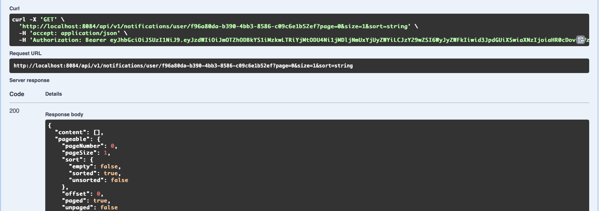
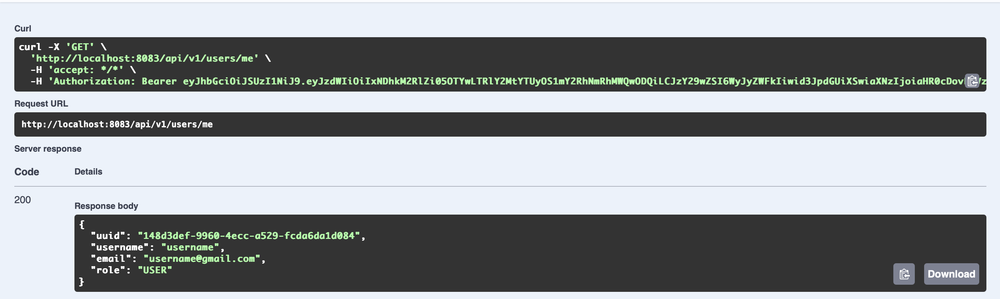
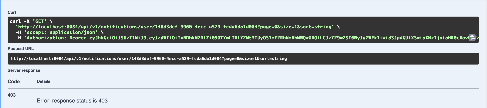

# Changelog 

---

## Интеграция Spring Security в Notification Service

В микросервисе **Notification Service** реализована ролевая модель доступа на базе входящих JWT-токенов. Права доступа к распределённым эндпоинтам истории уведомлений разграничены между ролями `USER` и `ADMIN`.

**User Service** выступает в роли доверенного сервиса (**Issuer**): он генерирует токены и публикует свой JWK-сет (публичные ключи) на эндпоинт `/.well-known/jwks.json`. На основе этих ключей Notification Service в рантайме криптографически валидирует подпись пришедшего токена (RSA-256) без прямых синхронных запросов в базу данных.

---

## Аутентификация админа (user-service):

Запрос на получение данных авторизованного админа **("role" : "ADMIN")**, изъятие ID пользователя для последующего запроса к Notification Service.

---

## Доступ админа к логам уведомлений (notification-service):

Запрос к Notification Service с токеном админа: статусный код **200 OK** и выгрузка истории. 
Массив уведомлений пуст (`"content": []`), так как учетная запись админа инициализирована напрямую через Liquibase-миграции PostgreSQL в обход сквозного потока регистрации (`POST /api/v1/authentication/register`) и Kafka.

---

## Аутентификация пользователя (user-service):

Запрос на получение данных авторизованного пользователя **("role" : "USER")**, изъятие ID пользователя для последующего запроса к Notification Service.

---

## Доступ пользователя к логам уведомлений (notification-service):

Запрос к Notification Service с токеном пользователя: статусный код **403 FORBIDDEN**.

