# Интеграция Google OAuth

# Шаг 1 - Инициализация проекта в Google Cloud

На этом шаге:
- начало создания проекта в Google Cloud Console, использующегося для интеграции Google OAuth в приложение;
- Указаны app name (leetcode) — название приложения, отображающееся пользователю при запросе доступа, User support email (batullina2005@gmail.com) — контактный e-mail для вопросов пользователей о согласии на доступ.

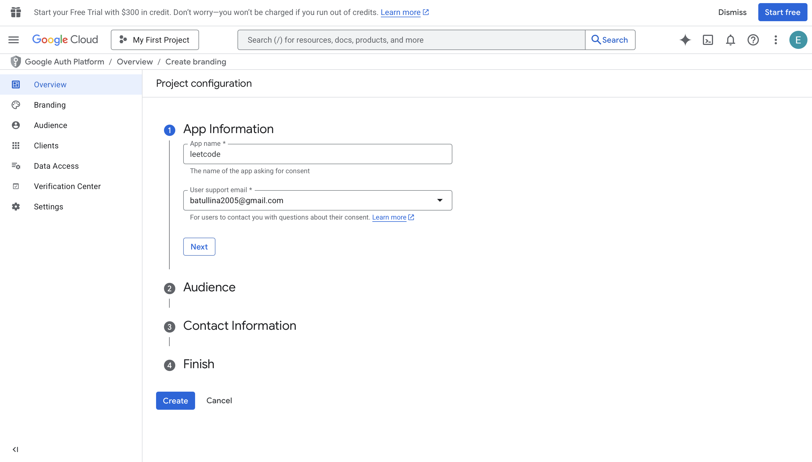

# Шаг 2 - Завершение инициализации проекта в Google Cloud

Заполняя оставшиеся поля, указываем:
- **Audience** — кто будет использовать приложение, в нашем случае External, приложение будет доступно для всех пользователей Google, а не только для внутрикорпоративных;
- **Settings** — дополнительные параметры проекта;
- **Contact Information** — подтверждаем контактные данные для связи с пользователями.

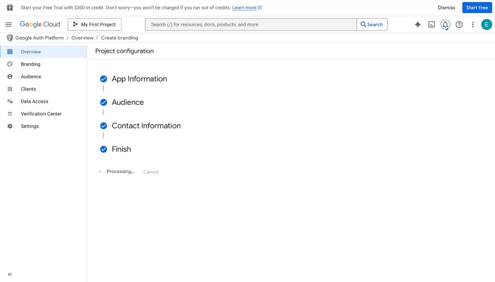

# Шаг 3 - Создание OAuth 2.0 client ID

Создается идентификатор клиента, использующийся для идентификации приложения на серверах Google.
Указываются:
- **Application type** — выбрали Web application, приложение работает как веб-сервис;
- **Name** — указали внутреннее имя клиента (Web client 1), использующееся только в консоли Google;
- **Authorized redirect URIs** — указываем https://developers.google.com/oauthplayground для тестирования OAuth 2.0-flow.

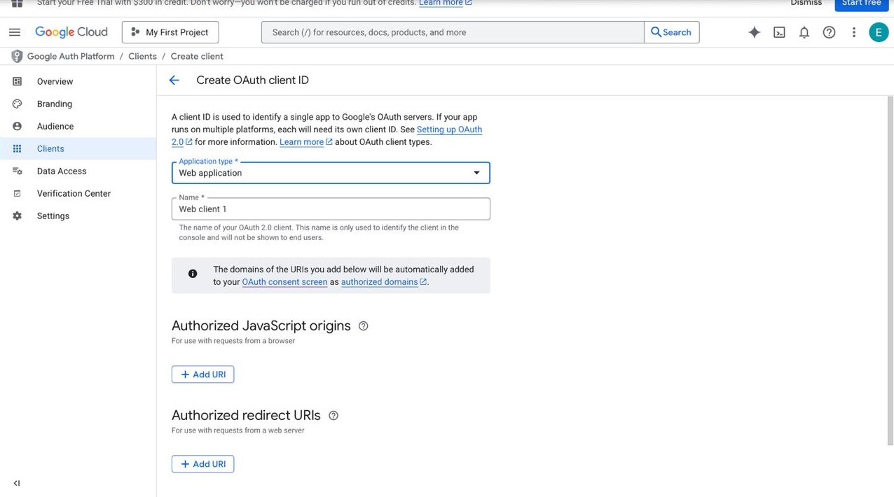

# Шаг 4 - Auth client created

На этом этапе:
- получен Client ID, использующийся приложением для идентификации при обращении к Google Auth server;
- сгенерирован Client Secret, применяемый серверной частью при обмене authorization code на access token;
- доступ к авторизации ограничен test users, указанными в Auth consent screen;
- параметры клиента(Client ID и Client Secret) сохранены и далее используются в конфигурации приложения.

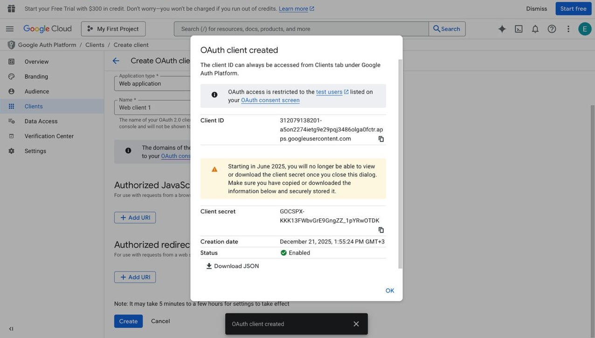

# Шаг 5 - OAuth 2.0 Playground — получение authorization code

Для проверки корректности OAuth-настройки используем Google OAuth 2.0 Playground.

На этом этапе:
- в разделе Use your own Auth credentials указаны ранее созданные OAuth Client ID и Client Secret;
- в качестве redirect URI используется
  https://developers.google.com/oauthplayground, добавленный в настройки клиента в Google Cloud Console;
- выбран Server-side auth flow, соответствующий backend-авторизации;
- заданы scopes: openid, email, profile, необходимые для получения идентификатора пользователя и базовой информации профиля;
- выполнена авторизация через Google с отображением consent screen.

Результатом этапа является получение authorization code, использующийся далее для обмена на access и ID token-ы.

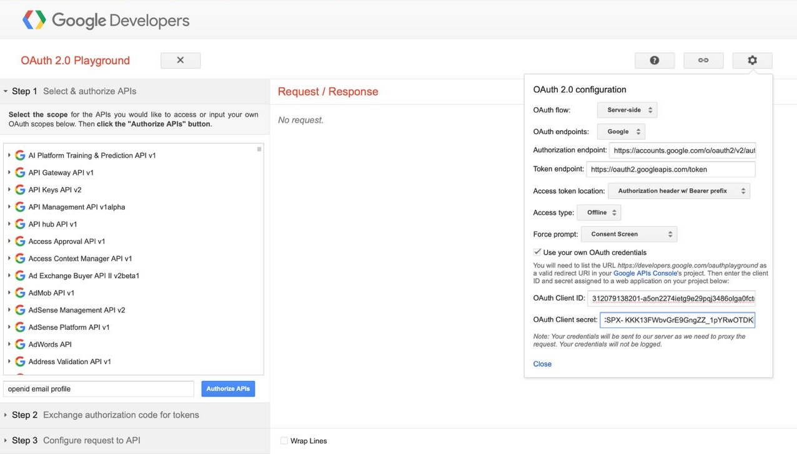

# Шаг 6 - Обмен ранее полученного authorization code на токены доступа

На этом этапе:
- используется authorization code, полученный на предыдущем шаге;
- выполняется запрос к Google Token endpoint;
- в ответ возвращаются access token для доступа к защищённым ресурсам и refresh token, позволяющий получить новый access token без повторной авторизации пользователя.

OAuth Playground автоматически отзывает refresh tokens через 24 часа, что допустимо для тестовой проверки авторизации и валидации OAuth-конфигурации.

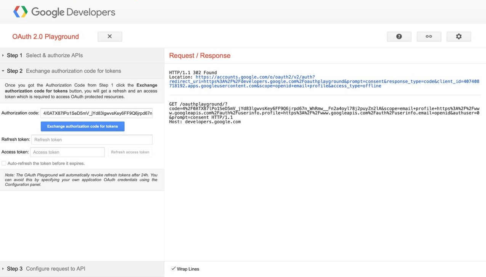

# Шаг 7 - Google Sign-In

Выбираем Google-аккаунт для аутентификации.

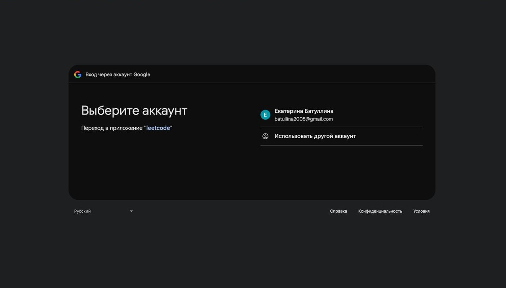

# Шаг 8 - Подтверждение разрешений для сервиса leetcode

Разрешаем доступ к следующим данным:
- Name and profile picture;
- Email address.

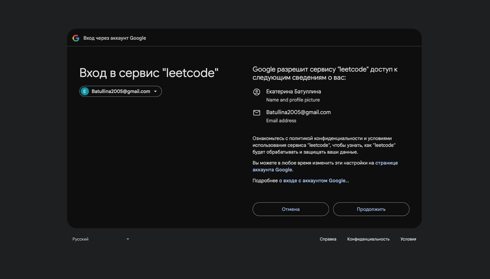

# Шаг 9 - Получение access id и refresh token-ов

На этом этапе:
- в OAuth 2.0 Playground выполнен обмен authorization code на токены в рамках OAuth 2.0 Authorization Code Flow.

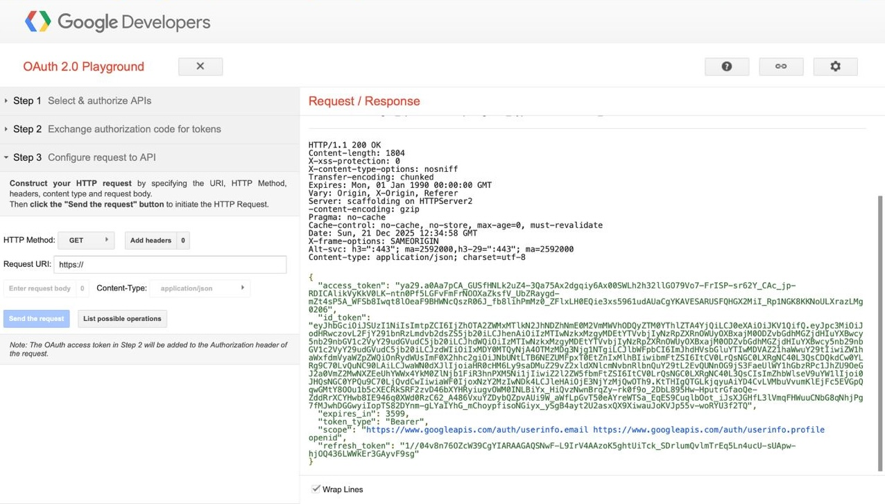

# Шаг 10 - Обмен id token через эндпоинт leetcode

На этом этапе:
- аутентификация пользователя через полученный Google ID Token на стороне backend-приложения;
- выполнен HTTP POST-запрос на эндпоинт /api/v1/authentication/login/google;
- в теле запроса передаётся параметр idToken, полученный от Google;
- выполняется валидация idToken (проверка подписи, issuer, audience);
- из токена извлекаются данные пользователя (email, name);
- пользователь ищется в базе данных, либо создаётся при отсутствии;
- после успешной проверки формируется внутренняя JWT-пара токенов.

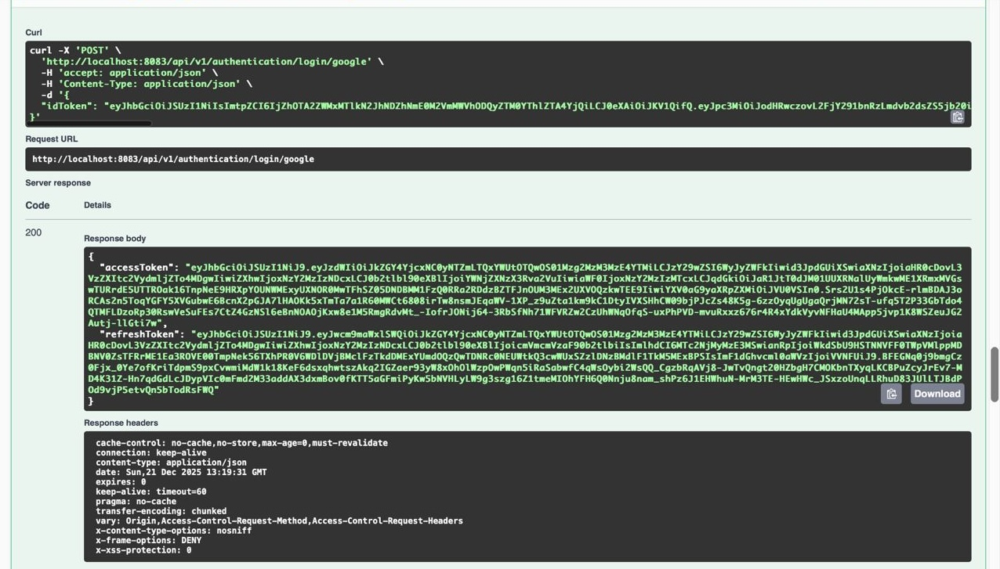

# Шаг 11 - Аутентификация через полученный access token

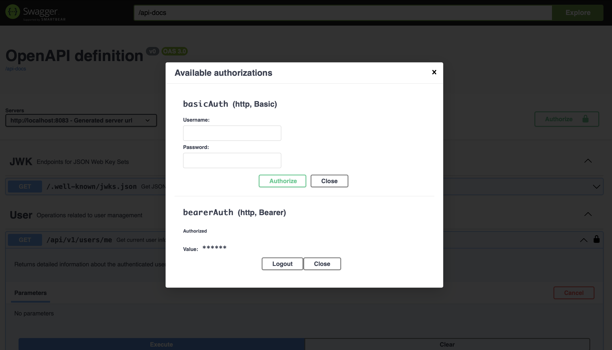

# Шаг 12 - Получение данных пользователя после успешной аутентификации через Google.

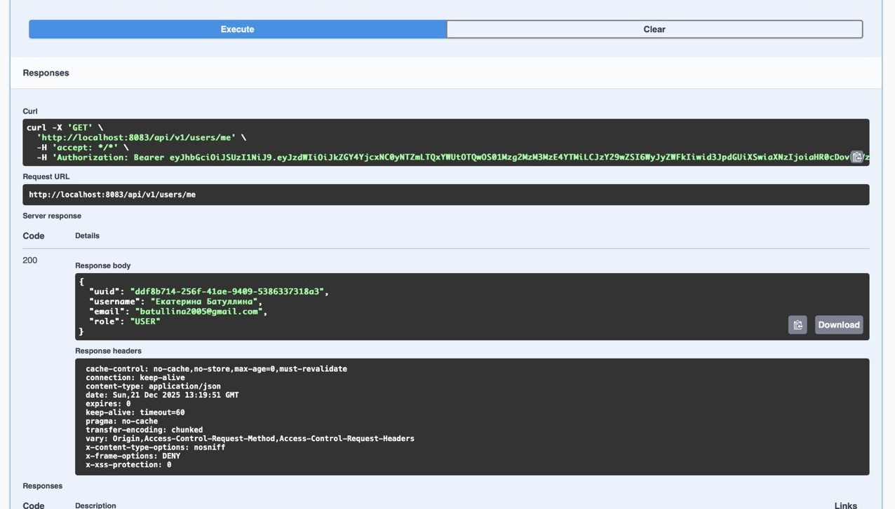