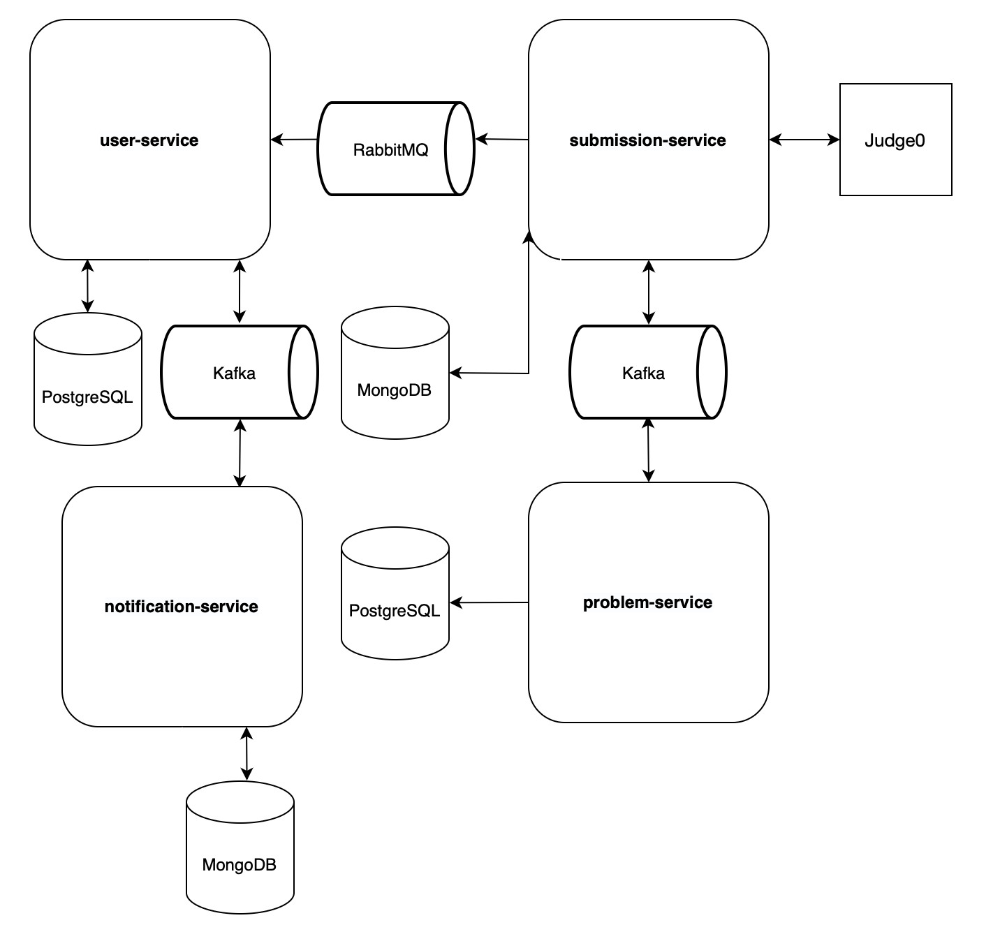
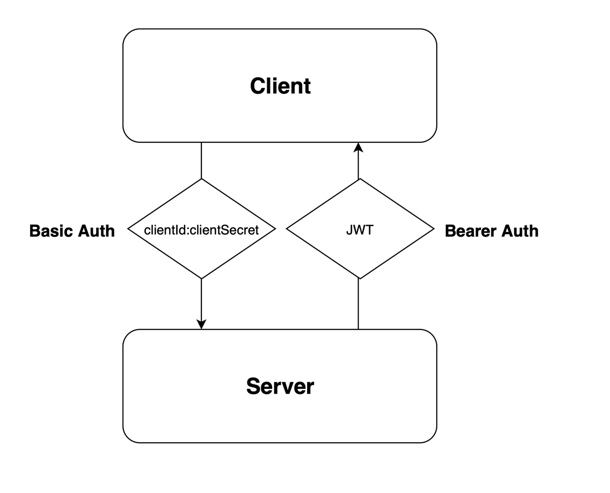
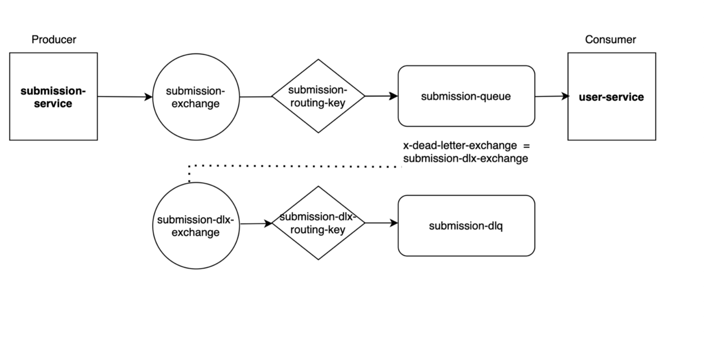

# LeetCode Clone (Microservices Architecture)

Проект представляет собой микросервисную платформу для решения алгоритмических задач (аналог LeetCode).

Основной фокус — распределённая архитектура, асинхронная обработка и отказоустойчивость системы.




---

## Core Services

### User Service
Сервис управления пользователями и их данными.

- Аутентификация: OAuth 2.0 / JWT (RSA-256)
- Хранение профилей в PostgreSQL
- Публикация событий в Kafka / RabbitMQ
- Поддержка пользовательской статистики (решения, активность)

---

### Problem Service
Сервис хранения и управления задачами.

- PostgreSQL как основное хранилище
- Версионирование и синхронизация через Kafka
- Поддержка фильтрации и поиска задач

---

### Submission Service
Основной вычислительный сервис системы.

- Принимает решения пользователей
- Асинхронная обработка через RabbitMQ
- Интеграция с Judge0 (self-hosted execution engine)
- Обработка очередей и результатов выполнения

---

### Notification Service
Сервис доставки уведомлений.

- MongoDB для хранения истории уведомлений
- Подписка на события через Kafka
- Асинхронная отправка уведомлений пользователям

---

## Architecture Highlights

### Observability & Logging (Spring AOP)

Централизованный слой логирования, реализованный на базе Spring AOP.
- Логирование вызовов методов уровней Controller / Service / Repository
- Сбор аргументов методов для отладки и трассировки
- Измерение времени выполнения repository-операций
- Полное отделение логики логирования от бизнес-логики (cross-cutting concern)
Это повышает наблюдаемость системы в распределённой микросервисной архитектуре и упрощает процесс отладки.

---

### Event-Driven Architecture
Система использует гибридную событийную модель:

- Kafka — для высоконагруженных событий (статистика, синхронизация данных)
- RabbitMQ — для гарантированной доставки задач (submission pipeline)

---

### Polyglot Persistence
Используются разные типы хранилищ под разные задачи:

- PostgreSQL — транзакционные данные (users, problems)
- MongoDB — гибкие структуры (notifications, event history)

---

### Code Execution Engine (Judge0)
Интегрирован локально развернутый Judge0:

- Изоляция выполнения кода
- Устранение зависимости от внешних API
- Повышение безопасности и контроля над исполнением

---

### Design Decisions

Технологии обмена сообщениями и хранения данных были выбраны исходя из требований системы к консистентности, пропускной способности и гибкости.

- MongoDB используется для уведомлений из-за гибкой структуры событий
- RabbitMQ используется для критичных задач с гарантированной доставкой
- Kafka используется для event streaming и слабосвязанных сервисов
- Spring AOP используется для централизованного логирования без нарушения бизнес-логики

---

# Security & Authentication Flow


Реализована промышленная модель безопасности на базе Spring Security и OAuth2 Resource Server.



## Multi-level Security Model

Обеспечивает stateless authentication и горизонтальную масштабируемость системы.

### Client Level (Basic Auth)
Публичные эндпоинты защищены через Basic Authentication.
Доступ предоставляется только доверенным клиентам (clientId:clientSecret) с использованием кастомного фильтра.

---

### User Level (JWT + RSA)
Аутентификация пользователей построена на JWT-токенах с асимметричным шифрованием.

- Токены подписываются приватным RSA-ключом (RSA-256)
- Публичный ключ используется для валидации на стороне Resource Server
- Реализовано управление ключами через PKCS8/X509
- Ротация ключей возможна через переменные окружения без пересборки приложения

---

### Authorization & Token Processing

- Stateless-проверка JWT (подпись + срок действия)
- Кастомный JwtAuthenticationConverter для маппинга claims → GrantedAuthority
- Поддержка ролевой модели с префиксом ROLE_
- Утилита SecurityUtil для безопасного извлечения userId из SecurityContext
---

# Reliability & Performance




Система спроектирована с учетом высокой нагрузки и отказоустойчивости.

## Reliable Messaging (RabbitMQ + DLX)

Асинхронное взаимодействие между сервисами реализовано через RabbitMQ.

- Используется Dead Letter Exchange (DLX) для обработки ошибок
- Сообщения, не обработанные потребителем, не теряются, а отправляются в DLQ
- Возможна повторная обработка и анализ ошибок

Это обеспечивает надежную доставку сообщений и консистентность данных.

---

## High-Performance Data Access (JdbcTemplate)

В критичных частях системы используется JdbcTemplate вместо ORM.

- Полный контроль над SQL-запросами
- Отсутствие проблемы N+1
- Снижение накладных расходов Hibernate

Это позволяет добиться высокой производительности при работе со статистикой пользователей.

---

## Caching Strategy

Используется многоуровневое кэширование на базе Spring Cache и Caffeine.

- Кэшируются ресурсоемкие операции чтения
- Настроены TTL и TTI политики
- Контролируется размер кэша

Это снижает нагрузку на базу данных и ускоряет отклик системы.

---

## API Overview

<details>
<summary><b>Нажмите, чтобы развернуть API</b></summary>

API разделён на доменные модули: аутентификация, пользователи, задачи, уведомления и интеграции.

---

### Authentication

- POST `/api/v1/authentication/register`  
  → Регистрация пользователя (через Basic Auth)

- POST `/api/v1/authentication/login`  
  → Вход в систему по логину и паролю (возвращает access + refresh токены)

- POST `/api/v1/authentication/token/refresh`  
  → Обновление JWT-токенов

- POST `/api/v1/authentication/login/google`  
  → Аутентификация через Google OAuth2

---

### User Management

- GET `/api/v1/users/me`  
  → Получение информации о текущем пользователе

- GET `/api/v1/users/me/statistic`  
  → Получение статистики (количество решений, успешность и т.д.)

- PATCH `/api/v1/users/me`  
  → Частичное обновление профиля

- DELETE `/api/v1/users/me`  
  → Удаление аккаунта

- GET `/api/v1/users`  
  → Получение списка пользователей (только для ADMIN, с пагинацией)

---

### Notification Service

- GET `/api/v1/notifications/user/{userId}`  
  → Получение уведомлений пользователя (с пагинацией)

- GET `/api/v1/notifications/status/{status}`  
  → Фильтрация уведомлений по статусу доставки

---

### Problem & Submission

- POST `/run`  
  → Запуск кода (асинхронно, без сохранения результата)

- POST `/submit`  
  → Отправка решения на проверку

- GET `/filters`  
  → Получение задач с фильтрацией (по сложности, тегам, с пагинацией)

---

### Judge0 Integration

- PUT `/api/v1/judge0/webhook`  
  → Обработка результатов выполнения кода от Judge0 (callback)

---

### Key Management (JWKS)

- GET `/.well-known/jwks.json`  
  → Получение публичных RSA-ключей для валидации JWT

</details>

---

## How to Run (Local Development)

<details>
<summary>Нажмите, чтобы развернуть инструкции по запуску</summary>

Проект запускается полностью в Docker-окружении и не требует ручной настройки инфраструктуры.

```bash
# 1. Клонировать репозиторий
git clone https://gitlab.com/EkaterinaBatullina/leetcode

# 2. Собрать проект (требуется JDK 21)
./gradlew clean build

# 3. Запустить всю инфраструктуру и микросервисы:
docker-compose up -d
```
</details>

---

## My Contribution

Спроектированы и реализованы ключевые backend-сервисы и событийная модель взаимодействия между микросервисами.

### User Service
- Спроектирована и реализована система аутентификации на базе JWT (RSA-256)
- Интеграция аутентификации через Google OAuth2
- Реализовано управление профилем пользователя и пользовательской статистикой

---

### Notification Service
- Разработан сервис доставки уведомлений
- Реализована асинхронная обработка событий из Kafka
- Добавлена поддержка email-уведомлений

---

### Messaging Infrastructure
Спроектировано межсервисное взаимодействие:
- RabbitMQ: используется для надёжной командной коммуникации (Submission → User)
- Kafka: используется для высоконагруженного event streaming (User → Notification)

Такое разделение позволяет балансировать между консистентностью, масштабируемостью и надёжностью доставки сообщений.

---

### Logging Starter
Обеспечивает единый observability layer для всех микросервисов без дублирования логики.

- Реализован AOP-based механизм логирования для Controller / Service / Repository слоев
- Поддержка логирования аргументов методов и времени выполнения

---

## Documentation

- [Google OAuth2 Integration](docs/google-auth-integration.md)
- [Email Notification Service](docs/email-notification-service.md)