# LeetCode Clone (Microservices Architecture)

**Тип проекта:** Командная разработка (2 человека)

Проект представляет собой микросервисную backend-платформу для решения алгоритмических задач (аналог LeetCode).

**Отвечала за реализацию:**
- **User Service** - аутентификация (JWT RSA-256), [Google OAuth2](docs/google-auth-integration.md), управление профилем пользователя и статистикой
- **Notification Service** - асинхронная обработка событий через Kafka, [отправка email-уведомлений](docs/email-notification-service.md)
- **Инфраструктура сообщений** - интеграция Kafka и RabbitMQ, реализация паттерна Transactional Outbox для доставки пользовательских событий (в текущей реализации - регистрации) из User Service в Notification Service
- **Logging Starter** - AOP-логирование для Controller / Service / Repository слоёв
- **CI/CD** - конфигурация пайплайнов, скрипты автоматического деплоя и настройки Nginx вынесены в отдельный репозиторий: [infrastructure на GitLab](https://gitlab.com/EkaterinaBatullina/infrastructure).

**Решаемая задача** - гарантированная доставка событий между сервисами в распределённой системе (Kafka + БД + повторная доставка сообщений)

**Основной фокус** - распределённая архитектура, асинхронная обработка и отказоустойчивость системы.

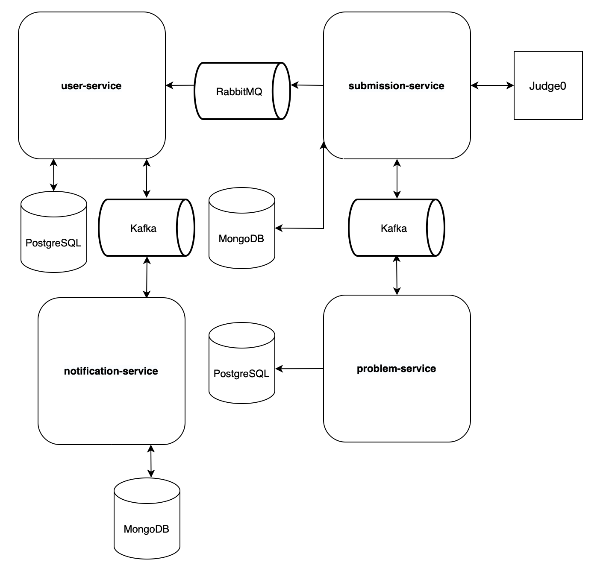

---

## User Service
Сервис управления пользователями и их данными.

- Аутентификация JWT (RSA-256) с поддержкой Google OAuth2
- Хранение профилей в PostgreSQL
- Публикация событий регистрации в Kafka и обработка обновлений статистики из RabbitMQ
- Поддержка пользовательской статистики (решения, активность)

---

## Swagger UI:

Интерактивная документация API с возможностью тестирования основных endpoints.

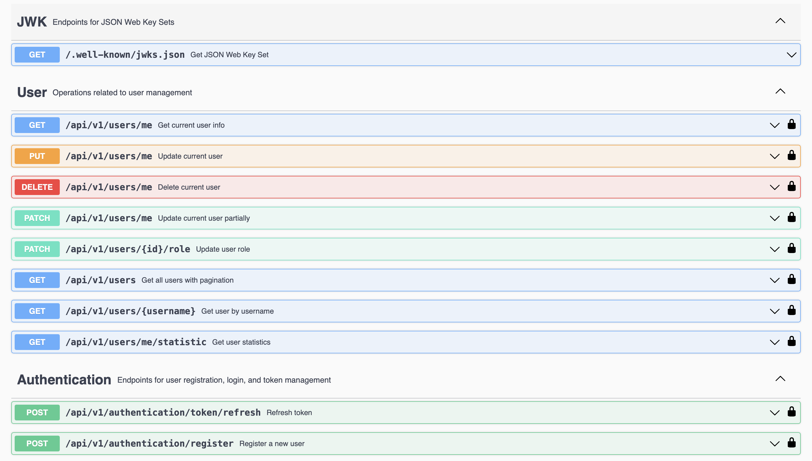
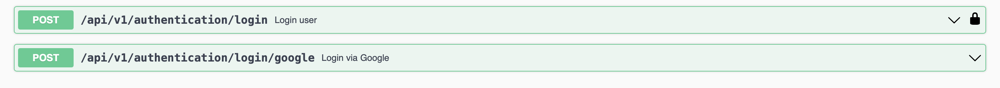

---

## Пример запроса на /login/google:
Обмен Google ID Token на access и refresh токены User Service

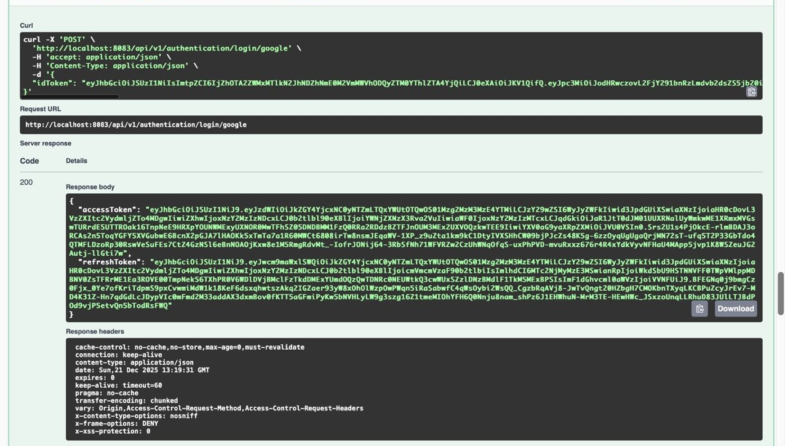

---

## Подробнее по интеграции Google OAuth2:

[google-auth-integration.md](docs/google-auth-integration.md) - 13 шагов + скриншоты (backend flow + обмен токенов + валидация + JWT + декодирование Google-token)

---

## Тестовое покрытие:

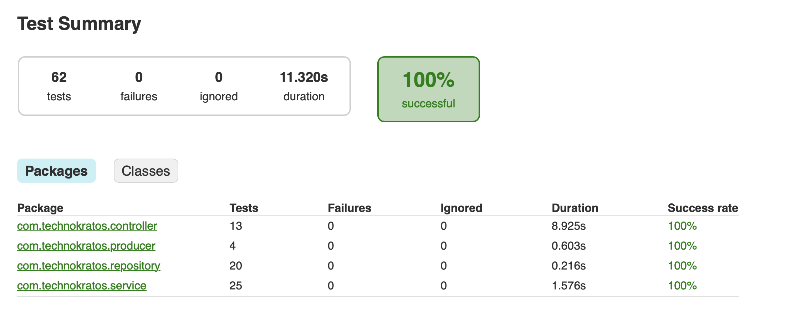

---

## Problem Service
Сервис хранения и управления задачами.

- PostgreSQL как основное хранилище
- Асинхронное взаимодействие между сервисами через Kafka
- Поддержка фильтрации и поиска задач

---

## Тестовое покрытие:

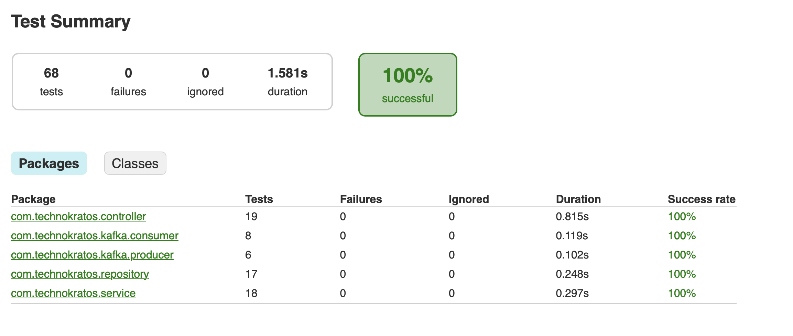

---

## Submission Service
Основной вычислительный сервис системы.

- Принимает и обрабатывает пользовательские решения
- Асинхронная обработка и интеграция через RabbitMQ
- Взаимодействие с Judge0 (локальный инстанс / RapidAPI) для выполнения кода
- Получение результатов через callback и обновление статусов выполнения

---

## Тестовое покрытие:

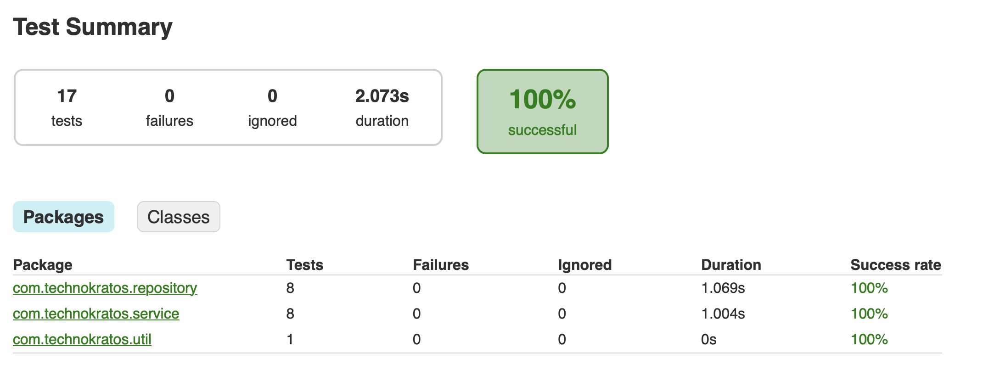

---

## Notification Service
Сервис доставки уведомлений

- MongoDB для хранения истории уведомлений
- Асинхронная обработка событий из Kafka
- Синхронная отправка Email-уведомлений

---

## Получение письма после регистрации:

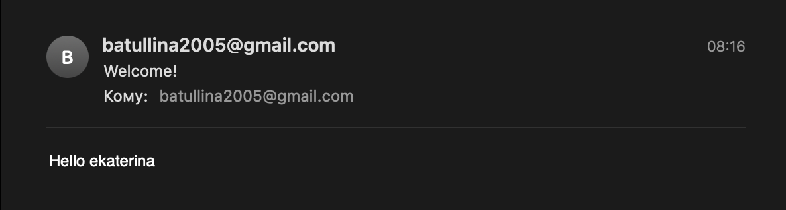

---

## Подробнее по работе Notification Service:

[email-notification-service.md](docs/email-notification-service.md) - 8 шагов реализации + скриншоты (регистрация пользователя → Kafka event → обработка события → отправка email → сохранение в MongoDB → получение уведомлений через API)

---

## Метрики и мониторинг

Для мониторинга работоспособности и производительности отправки в рантайме реализован кастомный сервис метрик на базе **Micrometer / Prometheus**.

---

## Инфраструктура сбора метрик (Prometheus)

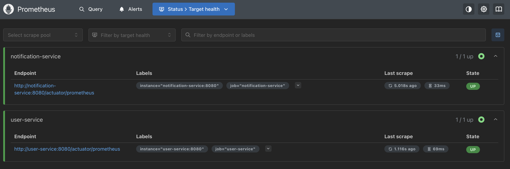

**Интерфейс Prometheus Target Health:** успешная регистрация джоб `user-service` / `notification-service` и зеленый статус `UP` при сборе метрик с эндпоинтов `/actuator/prometheus`.

---

## Визуализация метрик (Grafana)

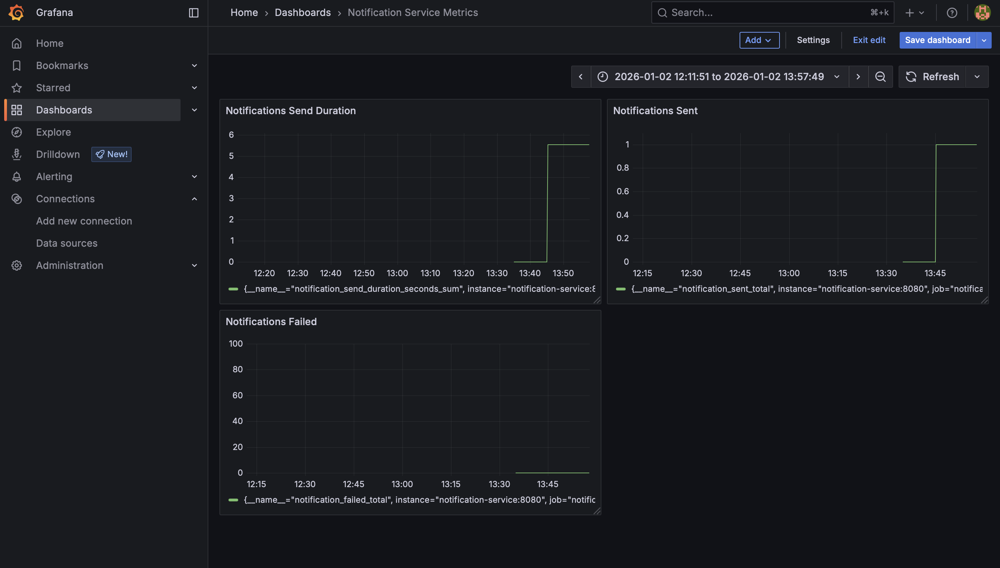

Дашборд **Notification Service Metrics** отображает ключевые показатели работы сервиса:
- Длительность отправки уведомлений (`notification_send_duration_seconds_sum`)
- Количество успешных доставок (`notification_sent_total`)
- Количество ошибок отправки (`notification_failed_total`)

---

## Тестовое покрытие:

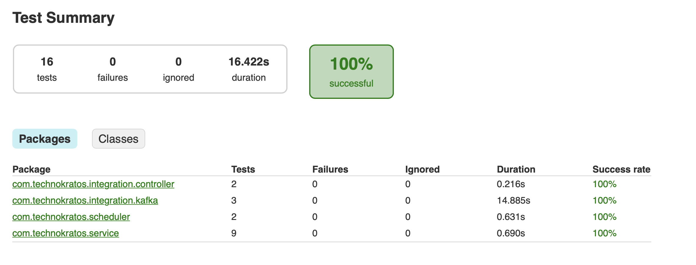

---

## Architecture Highlights

Система построена на событийной модели взаимодействия между сервисами:

- Kafka - используется для асинхронного обмена событиями между сервисами:
  - User → Notification (события регистрации)
  - Problem → Submission (публикация и обработка задач)

- RabbitMQ - используется для гарантированной доставки командных событий в процессе выполнения задачи:
  - Доставка события решения в User Service для обновления статистики

---

## Reliable Event Publishing (Transactional Outbox)

В проекте была решена задача обеспечения надёжного межсервисного взаимодействия в условиях распределённой системы.

Система работает в модели **at-least-once delivery**, поэтому требовалось обеспечить:
- отсутствие потери событий при сбоях БД и Kafka
- устойчивость к повторной доставке сообщений
- корректную обработку временно недоступных сервисов

---

### Схема работы:

- Событие сохраняется в таблицу `outbox` в рамках одной транзакции с бизнес-данными
- Планировщик (`@Scheduled`) периодически выбирает пакет событий со статусом `NEW`
- Перед обработкой события атомарно переводятся в состояние `PROCESSING`
- Публикация в Kafka выполняется асинхронно через единый `KafkaProducer`
- После подтверждения отправки событие помечается как `SENT`
- При ошибке отправки событие возвращается в состояние `NEW`
- Отдельный механизм восстановления возвращает зависшие события `PROCESSING → NEW`

---

### Особенности реализации:

- Тип события передается через Kafka-заголовок `__TypeId__`
- Callback-обработка выполняется в отдельном `ThreadPoolTaskExecutor`
- Обновление статуса выполняется в отдельной транзакции (`REQUIRES_NEW`)
- Реализация использует модель доставки at-least-once, поэтому потребители поддерживают идемпотентную обработку событий

После публикации события Notification Service использует **дополнительный уровень отказоустойчивости**:

- Ошибки обработки проходят через Kafka Retry Topics
- После исчерпания попыток событие отправляется в DLT
- Уведомления сохраняются в MongoDB до отправки email
- Повторная отправка неудачных уведомлений выполняется отдельным планировщиком
- Дубликаты событий определяются по `eventId`

---

### Результат

- отсутствие потери событий между БД и Kafka
- устойчивость к сбоям Kafka consumer
- устойчивость к временной недоступности SMTP/email сервиса
- восстановление обработки после аварийных завершений приложения

---

## Database Schema (User Service)

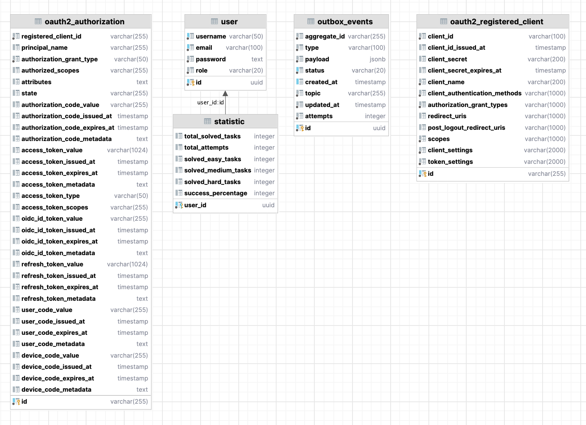

---

## Observability & Logging (Spring AOP)

Централизованный слой логирования, реализованный на базе Spring AOP.
- Логирование вызовов методов уровней Controller / Service / Repository
- Сбор аргументов методов для отладки и трассировки
- Измерение времени выполнения repository-операций
- Полное отделение логики логирования от бизнес-логики (cross-cutting concern)
Реализация повышает наблюдаемость системы в распределённой микросервисной архитектуре и упрощает процесс отладки.

---

## Polyglot Persistence

Используются разные типы хранилищ в зависимости от характера данных:

- **PostgreSQL** - основное транзакционное хранилище (users, problems)
- **MongoDB** - хранение гибких и событийных данных:
  - уведомления пользователей (Notification Service)
  - данные, связанные с результатами выполнения и историей событий Submission Service

---

## Code Execution Engine (Judge0)
Интегрирован локально развернутый Judge0:

- Изоляция выполнения кода
- Устранение зависимости от внешних API
- Повышение безопасности и контроля над исполнением

---

## Design Decisions
Технологии выбраны исходя из требований к асинхронности, масштабируемости и разделению ответственности в системе.

- **Kafka** - для событийного взаимодействия между сервисами
- **RabbitMQ** - для гарантированной доставки команд в execution pipeline
- **MongoDB** - для гибкого хранения событийных и исторических данных
- **PostgreSQL** - основное транзакционное хранилище
- **Spring AOP** - централизованное логирование

---

# Security & Authentication Flow
Реализована промышленная модель безопасности на базе Spring Security и OAuth2 Resource Server.

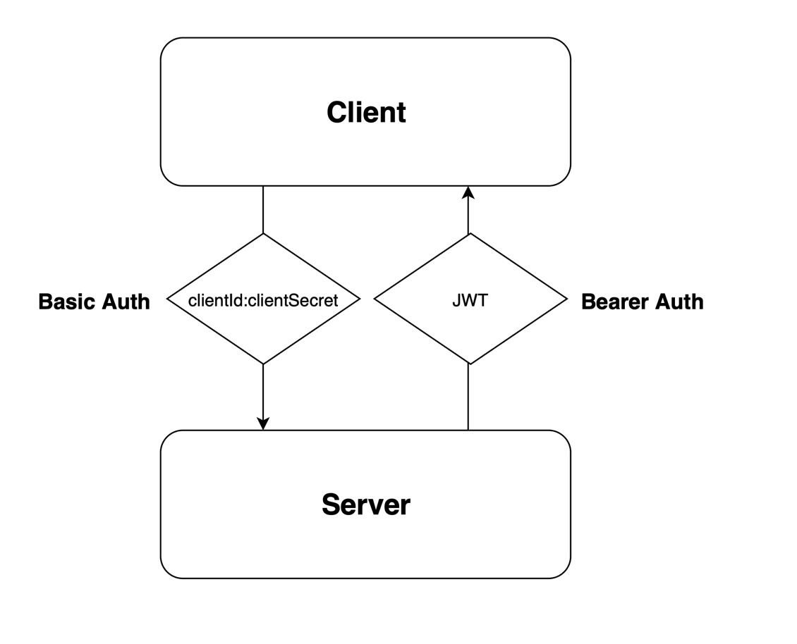

## Multi-level Security Model

Обеспечивает stateless-аутентификацию и горизонтальную масштабируемость системы.

### Client Level (Basic Auth)
Защита публичных и системных эндпоинтов через Basic Authentication.

- Доступ предоставляется только доверенным клиентам (clientId:clientSecret)
- Используется кастомный фильтр для проверки клиентских запросов

---

### User Level (JWT + RSA)
Аутентификация пользователей на основе JWT с асимметричным шифрованием.

- Токены подписываются приватным RSA-ключом (RSA-256)
- Валидация выполняется через публичный ключ на стороне Resource Server
- Используется PKCS8/X509 формат ключей
- Ротация ключей возможна через переменные окружения без пересборки приложения

---

### Authorization & Token Processing

- Stateless-валидация JWT (подпись + срок действия)
- Кастомный JwtAuthenticationConverter для маппинга claims → GrantedAuthority
- Ролевая модель с префиксом ROLE_
- Утилита SecurityUtil для безопасного извлечения userId из SecurityContext

---

# Reliability & Performance

Система спроектирована с учетом высокой нагрузки и отказоустойчивости.

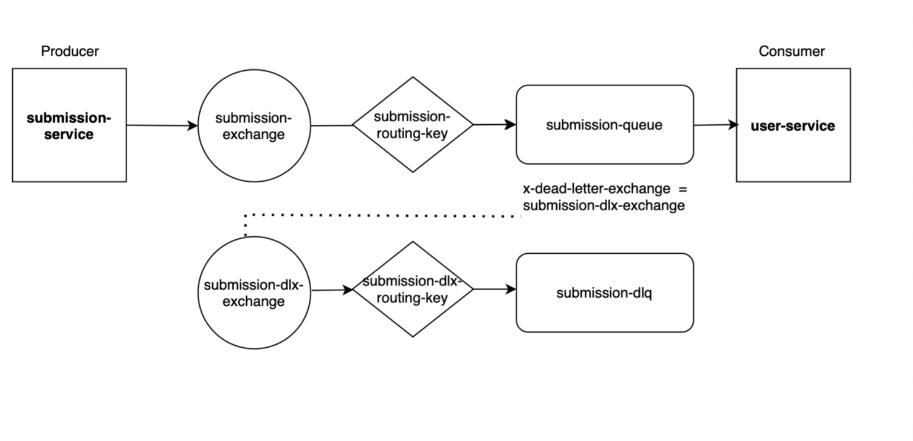


## Reliable Messaging (RabbitMQ + DLX)

Для обработки критичных асинхронных задач используется RabbitMQ с поддержкой Dead Letter Exchange (DLX).

- Сообщения, не обработанные потребителем, перенаправляются в Dead Letter Queue (DLQ)
- DLQ используется для анализа ошибок и повторной обработки сообщений
- Исключается потеря сообщений при сбоях потребителей

Реализация обеспечивает надёжную доставку сообщений и контроль над обработкой ошибок в execution pipeline.

---

## Optimized Data Access (JdbcTemplate)

В User Service для работы с данными используется JdbcTemplate вместо ORM.

- Прямой контроль над SQL-запросами и структурой данных
- Предсказуемое поведение запросов без скрытых абстракций
- Снижение накладных расходов за счёт отказа от ORM

Реализация позволяет эффективно обрабатывать пользовательские данные и статистику без дополнительного слоя абстракции.

---

## Caching Strategy

Используется in-memory кэширование на базе Spring Cache и Caffeine.

- Кэшируются операции чтения пользователей и статистики
- Настроены TTL-политики (expireAfterWrite)
- Ограничен размер кэша для контроля потребления памяти
- Используются отдельные кэши (users, statistic)

Консистентность данных обеспечивается через Cache Eviction:

- Инвалидация кэша при обновлении и удалении данных
- Актуализация кэша после изменения пользовательских данных и статистики

Реализация снижает нагрузку на базу данных и ускоряет отклик системы при повторных запросах.

---

## API Overview

<details>
<summary><b>Нажмите, чтобы развернуть API</b></summary>

API разделён на доменные модули: аутентификация, пользователи, задачи, уведомления и интеграции.

---

### Authentication

- POST `/api/v1/authentication/register`  
  → Регистрация пользователя (через Basic Auth)

- POST `/api/v1/authentication/login`  
  → Вход в систему по логину и паролю (возвращает access + refresh токены)

- POST `/api/v1/authentication/token/refresh`  
  → Обновление JWT-токенов

- POST `/api/v1/authentication/login/google`  
  → Аутентификация через Google OAuth2

---

### User Management

- GET `/api/v1/users/me`  
  → Получение информации о текущем пользователе

- GET `/api/v1/users/me/statistic`  
  → Получение статистики (количество решений, успешность и т.д.)

- PATCH `/api/v1/users/me`  
  → Частичное обновление профиля

- DELETE `/api/v1/users/me`  
  → Удаление аккаунта

- GET `/api/v1/users`  
  → Получение списка пользователей (только для ADMIN, с пагинацией)

---

### Notification Service

- GET `/api/v1/notifications/user/{userId}`  
  → Получение уведомлений пользователя (с пагинацией)

- GET `/api/v1/notifications/status/{status}`  
  → Фильтрация уведомлений по статусу доставки

---

### Problem & Submission

- POST `/run`  
  → Запуск кода (асинхронно, без сохранения результата)

- POST `/submit`  
  → Отправка решения на проверку

- GET `/filters`  
  → Получение задач с фильтрацией (по сложности, тегам, с пагинацией)

---

### Judge0 Integration

- PUT `/api/v1/judge0/webhook`  
  → Обработка результатов выполнения кода от Judge0 (callback)

---

### Key Management (JWKS)

- GET `/.well-known/jwks.json`  
  → Получение публичных RSA-ключей для валидации JWT

</details>

---

## How to Run (Local Development)

<details>
<summary>Нажмите, чтобы развернуть инструкции по запуску</summary>

Проект запускается в Docker-окружении и не требует ручной настройки инфраструктуры.

```bash
# 1. Клонировать репозиторий
git clone https://gitlab.com/EkaterinaBatullina/leetcode

# 2. Собрать проект (требуется JDK 21)
./gradlew clean build

# 3. Запустить всю инфраструктуру и микросервисы:
docker-compose up -d
```
</details>

---

## My Contribution

Спроектированы и реализованы ключевые backend-сервисы и событийная модель взаимодействия между микросервисами.

### User Service
- Спроектирована и реализована система аутентификации на базе JWT (RSA-256)
- Интеграция аутентификации через Google OAuth2
- Реализовано управление профилем пользователя и пользовательской статистикой

---

### Notification Service
- Разработан сервис доставки уведомлений
- Реализована асинхронная обработка событий из Kafka
- Добавлена поддержка email-уведомлений

---

### Messaging Infrastructure
Реализована интеграция отдельных сервисов через message brokers:
- RabbitMQ: используется для надёжной командной коммуникации (Submission → User)
- Kafka: используется для высоконагруженного event streaming (User → Notification)

Дополнительно реализован паттерн Transactional Outbox:

- События сохраняются в базе данных в рамках транзакции с бизнес-операциями
- Фоновый процесс отправляет события в Kafka
- Обеспечивается согласованность между БД и брокером сообщений и исключается потеря событий

Такое разделение позволяет балансировать между консистентностью, масштабируемостью и надёжностью доставки сообщений.

---

### Logging Starter
Обеспечивает единый observability layer для всех микросервисов без дублирования логики.

- Реализован AOP-based механизм логирования для Controller / Service / Repository слоев
- Поддержка логирования аргументов методов и времени выполнения

---

## Documentation

- [Google OAuth2 Integration](docs/google-auth-integration.md)
- [Email Notification Service](docs/email-notification-service.md)