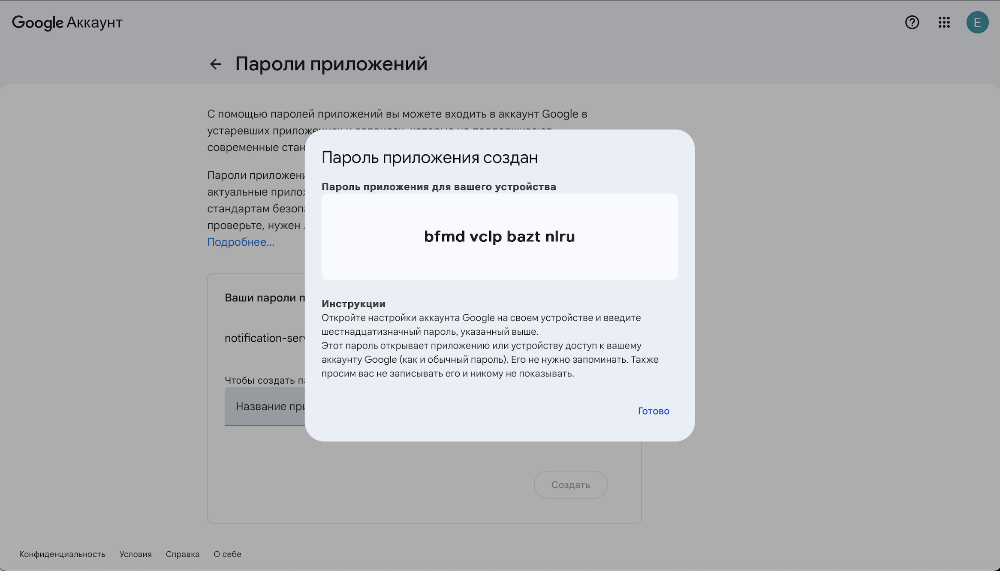
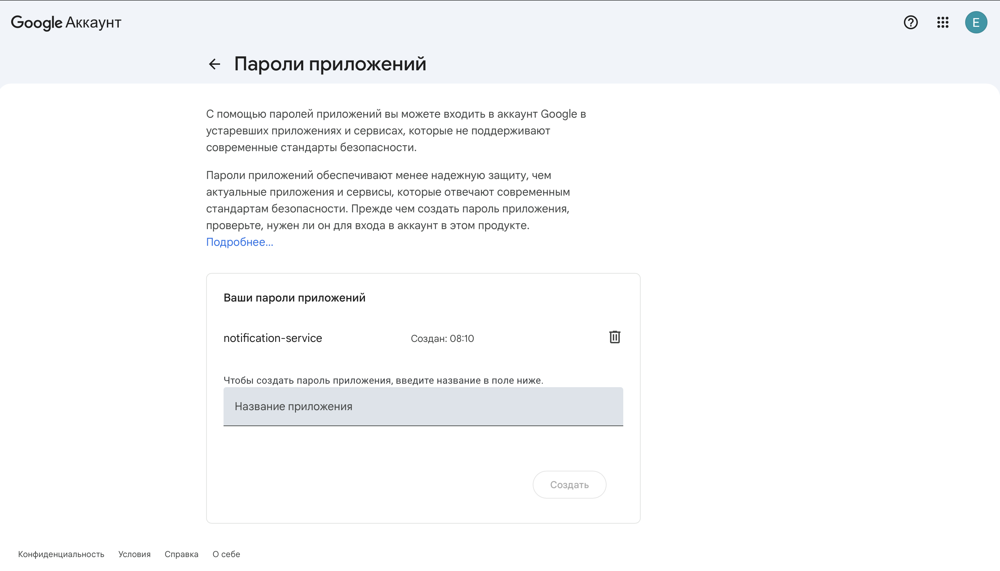
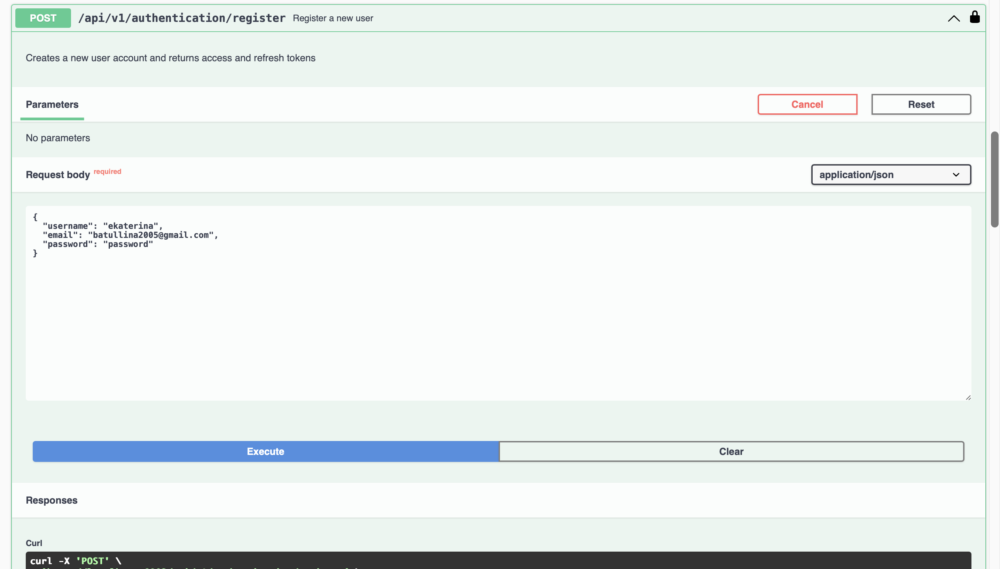
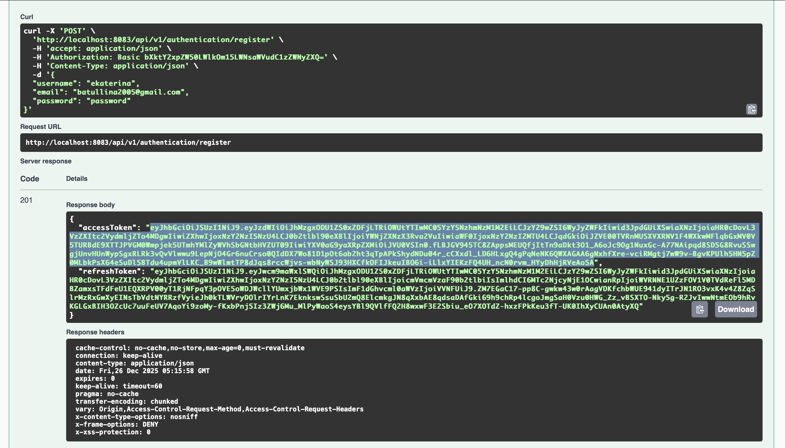
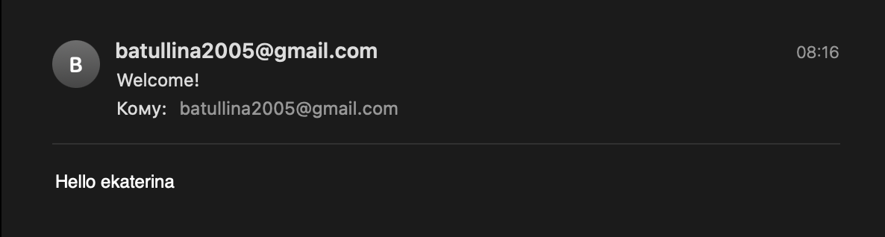
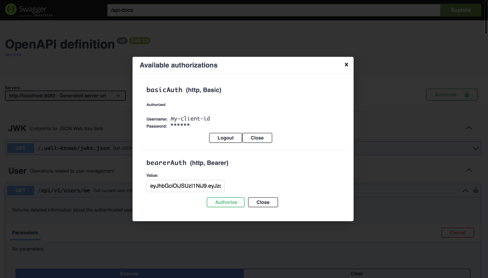
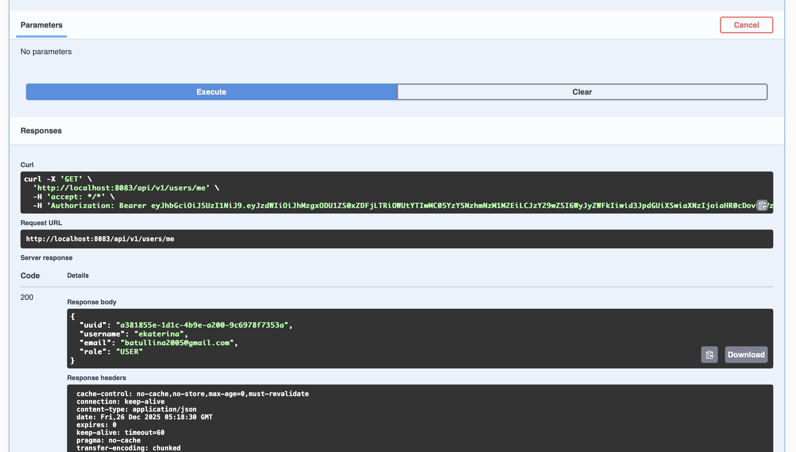
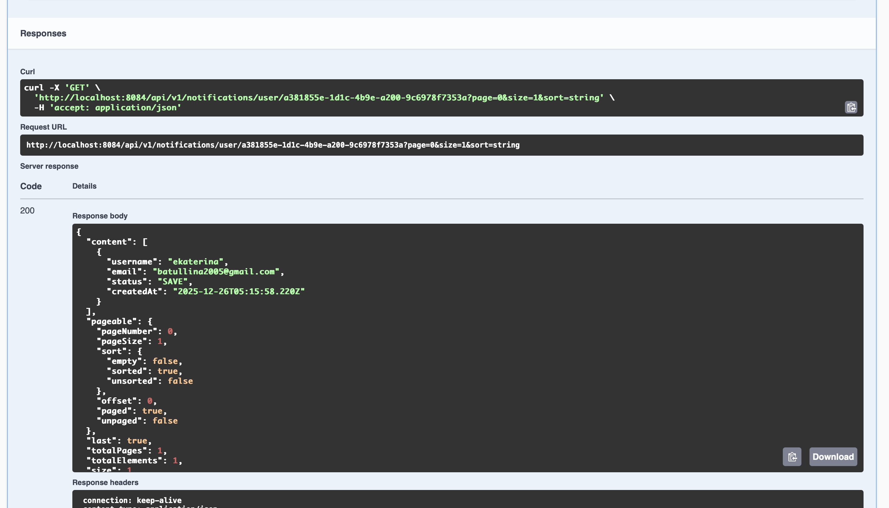

# Демонстрация работы notification-service

Регистрация пользователя запускает асинхронный event-driven процесс:

## Системный поток 

Пользователь регистрируется через API → 
User Service создаёт пользователя →
User Service публикует событие в Kafka →
Notification Service потребляет событие →
Отправляется email-уведомление пользователю →
Уведомление сохраняется в MongoDB и доступно через API

# Шаг 1: Создание пароля приложения в Google Account

На этом шаге:
- создан специальный 16-значный пароль для SMTP для отправки notification-service писем через Gmail. Он используется вместо основного пароля, не требуя двухэтапной аутентификации.

---

# Шаг 2: Пароль сгенерирован

На этом шаге:
- просмотрен созданный для notification-service пароль.

---

# Шаг 3: Регистрация пользователя через Swagger

На этом шаге:
- создан аккаунт пользователя, на email которого notification-service отправит уведомление.

---

# Шаг 4: Получение access и refresh tokens

На этом шаге:
- после успешной регистрации пользователя получены access и refresh tokens, используемые для Bearer-аутентификации при обращении к защищённым API.

---

# Шаг 5: Получение email уведомления

На этом шаге:
- после регистрации пользователя автоматически отправлено приветственное email-уведомление;
- письмо доставлено на адрес зарегистрированного пользователя.

---

# Шаг 6: Применение access token для входа пользователя

На этом шаге:
- скопирован полученный access token (Bearer) из ответа регистрации.

---

# Шаг 7: Просмотр информации авторизованного пользователя

На этом шаге:
- получена информация о текущем пользователе с помощью access token;
- извлечён userId, использующийся для запроса уведомлений пользователя в notification-service (MongoDB).

---

# Шаг 8: Получение отправленного уведомления из MongoDB

На этом шаге:
- выполнен GET-запрос к notification-service для получения уведомлений пользователя по его userId;
- получены username, email, статус отправки и дата создания.

